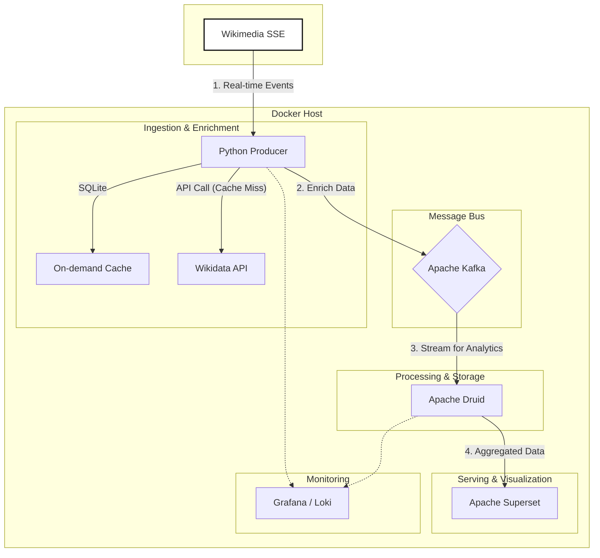

# WikiStreams: 실시간 위키미디어 트렌드 분석기

[](https://github.com/puding-development/wikiStreams/actions/workflows/ci.yml)

**WikiStreams**는 전 세계 위키미디어(위키피디아, 위키데이터 등)의 실시간 변경 로그 스트림을 분석하여 트렌드를 파악하는 데이터 파이프라인 프로젝트입니다. 홈 랩(Home Lab) 환경에서 운영되며, 비용을 들이지 않고 현업 수준의 실시간 데이터 처리 아키텍처를 구축하는 것을 목표로 합니다.

현재 데이터 수집, 보강, 저장 파이프라인이 완성되었으며, **Apache Druid**를 통한 실시간 분석과 **Apache Superset**을 이용한 시각화 대시보드를 제공합니다.

## 🏛️ 아키텍처 (Architecture)

복잡한 배치(Batch) 레이어를 제거하고 스트림 처리에 집중한 경량화된 **카파 아키텍처(Kappa Architecture)**를 따릅니다. 모든 인프라는 Docker Compose를 통해 코드로 관리됩니다(IaC).



*   **Source:** Wikimedia의 실시간 변경 이벤트 스트림 (SSE)
*   **Ingestion & Enrichment:** Python Producer가 이벤트를 실시간으로 수집 및 보강합니다.
    *   **On-demand Caching:** 위키데이터 Q-ID에 대한 정보를 **SQLite 로컬 캐시**에서 먼저 조회하여 API 호출을 최소화합니다.
*   **Message Bus:** Apache Kafka (KRaft 모드)가 데이터 허브 역할을 수행합니다.
*   **Real-time Analytics:** Apache Druid가 Kafka 데이터를 실시간으로 수집하고 인덱싱합니다.
*   **Visualization:** Apache Superset이 Druid 데이터를 시각화하며, 대시보드는 코드로 관리됩니다.
*   **Monitoring:** Loki, Promtail, Grafana 스택을 통해 로그와 시스템 상태를 모니터링합니다.

## 📂 프로젝트 구조

```
wikiStreams/
├── .github/workflows/   # CI/CD 파이프라인 (단위/통합/E2E 테스트)
├── docs/                # 개발 로그 및 문서
├── druid/               # Druid Ingestion Spec 설정
├── monitoring/          # Grafana, Loki, Promtail 설정
├── src/
│   └── producer/        # Python 데이터 수집기 소스
│       ├── config.py    # 중앙 집중식 설정 관리 (Pydantic)
│       └── ...
├── superset/            # Superset 설정 및 대시보드 관리
│   ├── dashboards/      # 대시보드 정의 파일 (.zip)
│   ├── init_superset.sh # 초기화 스크립트
│   └── ...
├── tests/               # 테스트 슈트 (Unit, Integration, E2E)
└── docker-compose.yml   # 전체 인프라 정의
```

## 🛠️ 기술 스택

*   **Data Pipeline:** Python 3.12+, Apache Kafka (KRaft)
*   **Analytics Engine:** Apache Druid
*   **Visualization:** Apache Superset
*   **Database:** PostgreSQL (Metadata), Redis (Cache), SQLite (Local Cache)
*   **Monitoring:** Grafana, Loki, Promtail
*   **Infrastructure:** Docker, Docker Compose
*   **Testing:** Pytest
*   **Code Quality:** Black, Flake8

## 🚀 시작하기 (Getting Started)

### 사전 요구사항

*   Docker 및 Docker Compose
*   Git

### 설치 및 실행

1.  **Git 저장소 복제:**
    ```bash
    git clone https://github.com/puding-development/wikiStreams.git
    cd wikiStreams
    ```

2.  **서비스 실행:**
    프로젝트 루트에서 다음 명령어로 모든 서비스(Kafka, Producer, Druid, Superset 등)를 실행합니다.
    ```bash
    docker compose up -d
    ```
    *초기 실행 시 이미지 다운로드 및 서비스 초기화(특히 Druid, Superset)에 수 분이 소요될 수 있습니다.*

3.  **서비스 접속:**
    *   **Apache Druid:** [http://localhost:8888](http://localhost:8888) (데이터 수집 현황 확인)
    *   **Apache Superset:** [http://localhost:8088](http://localhost:8088)
        *   로그인 ID/PW: `admin` / `admin`
    *   **Grafana:** [http://localhost:3000](http://localhost:3000) (시스템 로그 확인)

## ⚙️ 설정 관리 (Configuration)

`src/producer/config.py`의 `Settings` 클래스를 통해 주요 설정을 관리합니다. `pydantic-settings`를 사용하여 환경변수 우선순위를 적용합니다.

*   `KAFKA_BROKER`: Kafka 브로커 주소 (기본값: `localhost:9092`)
*   `BATCH_SIZE`: 한 번에 처리할 이벤트 수 (기본값: `500`)
*   `LOG_LEVEL`: 로그 레벨 (기본값: `INFO`)

## 🧪 테스트 전략

이 프로젝트는 `pytest`를 사용하여 강력한 테스트 체계를 갖추고 있습니다.

```bash
# 테스트 의존성 설치
pip install -r src/producer/requirements-dev.txt

# 전체 테스트 실행
PYTHONPATH=src pytest tests/

# 카테고리별 실행
PYTHONPATH=src pytest tests/unit/        # 단위 테스트
PYTHONPATH=src pytest tests/integration/ # 통합/E2E 테스트
```

*   **Unit Tests:** 외부 의존성 없이 로직 검증.
*   **Integration Tests:** Kafka, SQLite 캐시 등 실제 구성 요소와의 연동 검증.
*   **E2E Pipeline Tests:** `Producer -> Kafka -> Druid` 전체 흐름을 리소스 격리 환경에서 검증.

## ✅ 코드 품질 관리

CI 파이프라인에서 다음 도구들을 사용하여 코드 품질을 유지합니다.

```bash
black .   # 코드 포매팅
flake8 .  # 정적 분석
```