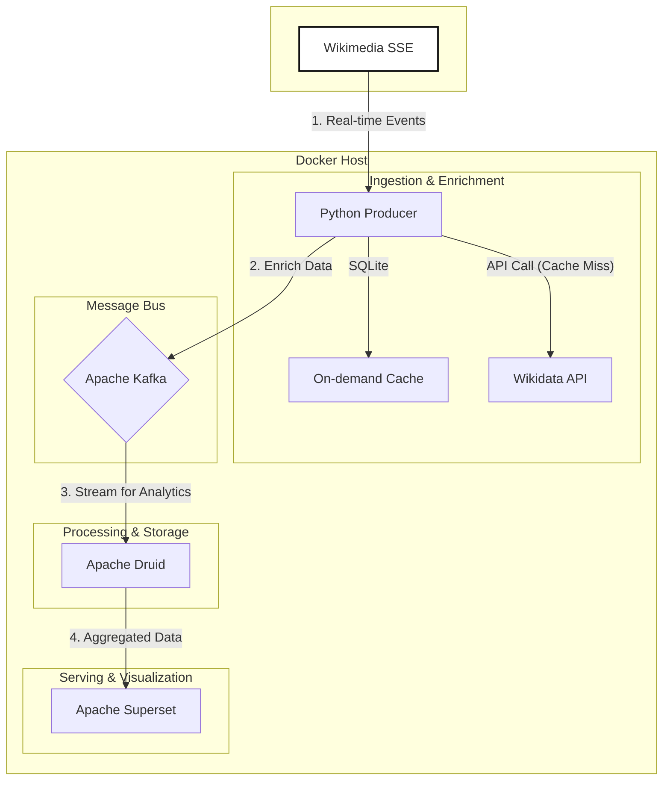

# WikiStreams: 실시간 위키미디어 트렌드 분석기

[](https://github.com/puding-development/wikiStreams/actions/workflows/ci.yml)

**WikiStreams**는 전 세계 위키미디어(위키피디아, 위키데이터 등)의 실시간 변경 로그 스트림을 분석하여 트렌드를 파악하는 데이터 파이프라인 프로젝트입니다. 홈 랩(Home Lab) 환경에서 운영되며, 비용을 들이지 않고 현업 수준의 실시간 데이터 처리 아키텍처를 구축하는 것을 목표로 합니다.

현재 데이터 수집 및 보강 파이프라인이 완성되었으며, 최종 목표인 실시간 분석 대시보드를 **Apache Superset**으로 구축하는 단계를 진행하고 있습니다.

## 🏛️ 아키텍처: 실용적 카파 아키텍처 (Pragmatic Kappa Architecture)

복잡한 배치(Batch) 레이어를 제거하고 스트림 처리에 집중하여, 1인 개발자가 유지보수하기 용이하도록 시스템을 경량화했습니다. 모든 인프라는 Docker Compose를 통해 코드로 관리됩니다(IaC).



*   **Source:** Wikimedia의 실시간 변경 이벤트 스트림 (SSE)
*   **Ingestion & Enrichment:** Python Producer가 이벤트를 실시간으로 수집합니다.
    *   **On-demand Caching:** 이벤트의 `title`이 위키데이터 Q-ID인 경우, **SQLite 기반의 로컬 캐시**를 먼저 조회합니다.
    *   캐시에 정보가 없으면 Wikidata API를 호출하여 이름(Label)과 설명(Description)을 가져와 캐시에 저장합니다.
    *   보강된 데이터(Enriched Data)를 Kafka로 전송하여 데이터 스키마의 일관성을 확보합니다.
*   **Message Bus:** Apache Kafka (KRaft 모드, Zookeeper-less)가 데이터 허브 역할 수행
*   **Real-time Analytics:** Apache Druid가 Kafka로부터 데이터를 실시간으로 수집하고 집계
*   **Visualization:** Apache Superset을 통해 Druid 데이터를 실시간으로 시각화하고 대시보드를 구축합니다.

## 🛠️ 기술 스택

*   **Data Pipeline:** Python, Apache Kafka, Apache Druid
*   **Infrastructure:** Docker, Docker Compose
*   **Visualization:** Apache Superset
*   **DataOps & CI/CD:** Git, GitHub Actions
*   **Code Quality:** Black (Formatter), Flake8 (Linter)

## 🚀 시작하기 (Getting Started)

이 프로젝트를 로컬 환경에서 실행하기 위한 가이드입니다.

### 사전 요구사항

*   Docker 및 Docker Compose가 설치되어 있어야 합니다.
*   Git이 설치되어 있어야 합니다.

### 설치 및 실행

1.  **Git 저장소 복제:**
    ```bash
    git clone https://github.com/puding-development/wikiStreams.git
    cd wikiStreams
    ```

2.  **Docker Compose 실행:**
    프로젝트 루트 디렉토리에서 다음 명령어를 실행하여 모든 서비스(Kafka, Producer, Druid)를 백그라운드에서 시작합니다.
    ```bash
    docker compose up -d
    ```
    *초기 실행 시 Druid 이미지를 다운로드하는 데 몇 분 정도 소요될 수 있습니다.*

3.  **데이터 흐름 확인:**
    새로운 터미널을 열고, 아래 명령어를 실행하여 Kafka의 `wikimedia.recentchange` 토픽에 데이터가 실시간으로 들어오는지 확인합니다.
    ```bash
    docker exec -it kafka-kraft kafka-console-consumer \
    --bootstrap-server kafka-kraft:29092 \
    --topic wikimedia.recentchange
    ```
    JSON 형태의 데이터가 터미널에 계속해서 출력되면 성공입니다. `wikidata_label` 필드가 포함되어 있는지 확인해 보세요.

4.  **Druid 콘솔 접속:**
    웹 브라우저에서 `http://localhost:8888` 로 접속하여 Apache Druid 웹 콘솔을 확인할 수 있습니다.

## ✅ 코드 품질 관리

이 프로젝트는 GitHub Actions를 통해 CI(Continuous Integration) 파이프라인을 운영합니다. 모든 코드는 `main` 브랜치에 Push 되기 전에 **Black**과 **Flake8**의 코드 품질 검사를 통과해야 합니다.

로컬에서 코드 품질을 검사하려면 다음을 실행하세요:
```bash
# 포매터/린터 설치
pip install black flake8

# Black으로 자동 포맷팅
black .

# Flake8으로 린트 검사
flake8 .
```
