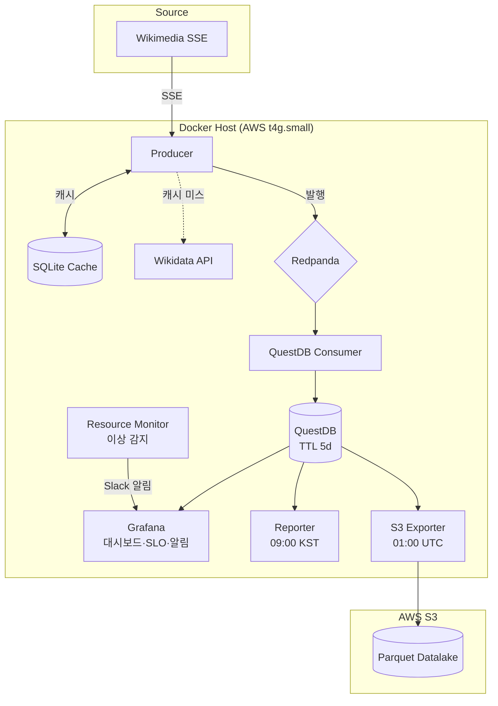

# WikiStreams: 실시간 위키미디어 트렌드 분석기

[](https://github.com/puding-development/wikiStreams/actions/workflows/ci.yml)

**WikiStreams**는 전 세계 위키미디어(위키피디아, 위키데이터)의 실시간 편집 스트림을 수집·분석하여 트렌드를 파악하는 홈랩 데이터 파이프라인입니다. 현업 수준의 아키텍처(카파 아키텍처, SLO 기반 운영, 이상 감지 알림)를 **월 $15(AWS t4g.small)** 단일 호스트에서 구현합니다.

> 📄 **상세 회고 및 포트폴리오** → [`docs/PORTFOLIO.md`](docs/PORTFOLIO.md)

### 핵심 성과

| 지표 | 수치 |
|---|---|
| 스택 메모리 절감 | 4,043 MiB → 947 MiB (**-77%**) |
| QuestDB 쿼리 p99 | 52ms → 9~16ms (**-83%**) |
| 배치 처리 p95 | 1.208s → 0.723s (**-40%**) |
| 처리량 | ~1,000 events/min, TTL 5일 |
| 월 운영비 | **~$15** (t4g.small + EBS) |
| 단위 테스트 | **276개** (외부 의존성 없음) |
| SLO 항목 | **11개** 정의·모니터링 중 |

---

## 아키텍처

복잡한 배치 레이어 없이 스트림 처리에 집중한 **카파 아키텍처(Kappa Architecture)** 를 따릅니다. 모든 인프라는 Docker Compose로 코드로 관리됩니다(IaC).

```
Wikimedia SSE Stream
  → Producer (Python)       # 이벤트 수집 + Wikidata 레이블 보강 (SQLite 캐시)
  → Redpanda (Kafka-compat) # 메시지 버스
  → QuestDB                 # 시계열 DB (TTL 5일, Parquet 백업)
  → Grafana                 # 대시보드 + SLO 모니터링 + 알림
  → Reporter (Python)       # 매일 09:00 KST 트렌드 요약 → Slack
  → S3 Exporter (Python)    # 매일 01:00 UTC Parquet → S3 Datalake
```


```mermaid
graph TD
    subgraph Source
        A[Wikimedia SSE]
    end

    subgraph "Docker Host (AWS t4g.small)"
        B[Producer]
        C[(SQLite Cache)]
        D[Wikidata API]
        E{Redpanda}
        F[(QuestDB\nTTL 5d)]
        G[QuestDB Consumer]
        H[Grafana\n대시보드·SLO·알림]
        I[Reporter\n09:00 KST]
        J[Resource Monitor\n이상 감지]
        K[S3 Exporter\n01:00 UTC]
    end

    subgraph "AWS S3"
        L[(Parquet Datalake)]
    end

    A -->|SSE| B
    B <-->|캐시| C
    B -.->|캐시 미스| D
    B -->|발행| E
    E --> G --> F
    F --> H
    F --> I
    F --> K --> L
    J -->|Slack 알림| H
```

---

## 주요 기능

| 기능 | 설명 |
|---|---|
| 실시간 수집 | Wikimedia SSE 스트림 → 500건/배치, 지수 백오프 재연결 |
| Wikidata 보강 | Q-ID → 레이블·설명 조회. SQLite 캐시(TTL: 정상 30일, 빈 레이블/missing 3시간) |
| 스키마 검증 | Pydantic 모델 기반 입력 검증 — 불일치 이벤트는 DLQ 격리 |
| 트렌드 리포트 | Claude Haiku로 Top5 선정 + 뉴스 스크래핑 → Slack 리포트 |
| 이상 감지 | CPU/메모리/I/O z-score 기반 감지 → Slack 알림 (warning/critical) |
| SLO 운영 | 가용성·성능·신뢰성·데이터 품질 5개 영역 SLO 대시보드 + 알림 |
| S3 Datalake | 일일 Parquet(Snappy) → S3. Hive 파티셔닝, DuckDB로 과거 조회 가능 |

---

## 기술 스택

| 영역 | 기술 |
|---|---|
| 수집·보강 | Python 3.11, Pydantic, SQLite |
| 메시지 버스 | Redpanda (Kafka 호환, KRaft) |
| 시계열 DB | QuestDB 9.3.3 (ILP + REST API, TTL) |
| 시각화·모니터링 | Grafana (QuestDB 기반 SLO 대시보드) |
| AI 리포팅 | Claude Haiku (`claude-haiku-4-5`) |
| Datalake | PyArrow, Parquet(Snappy), AWS S3 |
| 인프라 | Docker, Docker Compose, AWS EC2 (t4g.small, Seoul) |
| 테스트 | Pytest, pytest-mock, pytest-docker |
| 코드 품질 | Black, Flake8, GitHub Actions CI |

---

## 빠른 시작

### 사전 요구사항

- Docker + Docker Compose
- `.env` 파일 (아래 참조)

### `.env` 설정

```bash
# Claude API (Reporter 사용 시 필수)
ANTHROPIC_API_KEY="sk-ant-..."

# Slack Webhook (알림 수신)
SLACK_ALERT_WEBHOOK_URL="https://hooks.slack.com/services/..."

# Reporter 프롬프트 스타일: default | doro
# PROMPT_STYLE=default
```

Reporter·알림 없이 파이프라인만 사용한다면 모두 생략 가능합니다.

### 전체 서비스 실행

```bash
git clone https://github.com/puding-development/wikiStreams.git
cd wikiStreams
docker compose up -d
```

초기 실행 시 이미지 빌드 + QuestDB 스키마 초기화에 수십 초 소요됩니다.

### 서비스 접속

| 서비스 | 주소 | 용도 |
|---|---|---|
| Grafana | http://localhost:3000 | 대시보드 + SLO 모니터링 |
| QuestDB | http://localhost:9000 | SQL 콘솔 직접 쿼리 |
| Redpanda | localhost:9092 | Kafka 호환 메시지 브로커 |

---

## 프로젝트 구조

```
wikiStreams/
├── .github/workflows/      # CI (Lint + Unit Tests + Integration Tests)
├── benchmark/              # Redpanda vs Kafka, QuestDB vs ClickHouse 벤치마크
├── clickhouse/             # (레거시) 마이그레이션 전 스키마
├── docs/                   # 개발 문서
│   ├── DEV_LOG.md          # 시간순 개발 기록 (38개 항목)
│   ├── ARCH_LIGHTENING_REPORT.md  # 아키텍처 경량화 벤치마크 리포트
│   ├── SLO.md / SLI.md / SLA.md  # SRE 문서
│   ├── NFR.md / SRE.md     # 비기능 요구사항 / SRE 정책
│   └── TROUBLE_SHOOTING.md # 트러블슈팅 기록
├── monitoring/             # Grafana 대시보드 3종 + 알림 규칙
├── scripts/                # launchd plist (Mac Mini 자동 시작)
├── src/
│   ├── producer/           # SSE 수집 + Wikidata 보강 + Kafka 발행
│   ├── questdb_consumer/   # Redpanda → QuestDB ILP 적재
│   ├── reporter/           # Claude Haiku 트렌드 리포트
│   ├── resource_monitor/   # CPU/메모리 이상 감지 + Slack 알림
│   └── s3_exporter/        # QuestDB → Parquet → S3
├── tests/
│   ├── unit/               # 276개 단위 테스트 (외부 의존성 없음)
│   └── integration/        # Redpanda, SQLite, Wikipedia API 연동 테스트
└── docker-compose.yml      # 전체 인프라 정의 (7개 서비스)
```

---

## EC2 배포

### 인스턴스 스펙

| 항목 | 값 |
|---|---|
| 인스턴스 | AWS EC2 t4g.small (Graviton3, ARM64) |
| RAM | 2 GiB |
| 리전 | ap-northeast-2 (Seoul) |
| SSH 별칭 | `ssh wikistreams` (`~/.ssh/config` 등록) |

### 초기 서버 설정

EC2 인스턴스 최초 접속 후 Docker 설치:

```bash
ssh wikistreams

# Docker 설치 (Amazon Linux 2023 기준)
sudo yum update -y
sudo yum install -y docker git
sudo systemctl enable --now docker
sudo usermod -aG docker ec2-user

# Docker Compose plugin 설치
sudo mkdir -p /usr/local/lib/docker/cli-plugins
sudo curl -SL https://github.com/docker/compose/releases/latest/download/docker-compose-linux-aarch64 \
  -o /usr/local/lib/docker/cli-plugins/docker-compose
sudo chmod +x /usr/local/lib/docker/cli-plugins/docker-compose

# 재접속 후 확인
exit && ssh wikistreams
docker compose version
```

### 배포

```bash
ssh wikistreams

git clone https://github.com/puding-development/wikiStreams.git
cd wikiStreams

# .env 파일 생성
cat > .env <<EOF
ANTHROPIC_API_KEY="sk-ant-..."
SLACK_WEBHOOK_URL="https://hooks.slack.com/services/..."
SLACK_ALERT_WEBHOOK_URL="https://hooks.slack.com/services/..."
EOF

docker compose up -d
```

### 업데이트 배포

```bash
ssh wikistreams
cd wikiStreams

git pull

# 변경된 서비스만 재빌드
docker compose build producer && docker compose up -d producer

# 전체 재시작
docker compose down && docker compose up -d
```

### 운영 접근

EC2는 외부에서 직접 접근하지 않고 SSH 터널링으로 사용합니다.

```bash
# Grafana (로컬 브라우저에서 http://localhost:3000)
ssh -L 3000:localhost:3000 wikistreams

# QuestDB 콘솔 (로컬 브라우저에서 http://localhost:9000)
ssh -L 9000:localhost:9000 wikistreams

# 여러 포트 동시 포워딩
ssh -L 3000:localhost:3000 -L 9000:localhost:9000 wikistreams
```

### 현재 메모리 현황 (2026-03-12 기준)

아키텍처 경량화 4단계 완료 후 t4g.small에서 안정 운영 중입니다.

```
컨테이너 합산 RSS:  ~947 MiB / 2,048 MiB (46%)
시스템 available:   ~568 MiB
Swap 사용:          ~205 MiB  (안정 수준)
```

| 컨테이너 | RAM |
|---|---|
| QuestDB | ~408 MiB (mem_limit: 1100m, TTL 5d) |
| Redpanda | ~288 MiB |
| Grafana | ~138 MiB |
| Producer | ~51 MiB |
| Resource Monitor | ~38 MiB |
| 기타 (consumer, reporter, s3-exporter) | ~22 MiB |

### 운영 주의사항

> **메모리 제약**: t4g.small은 RAM 2 GiB입니다. EC2에서 Node.js, npm install 등 무거운 프로세스를 직접 실행하면 OOM이 발생할 수 있습니다. 모든 작업은 Docker 컨테이너 안에서 실행하세요.

```bash
# 현재 메모리 상태 확인
ssh wikistreams "free -h"

# 컨테이너별 리소스 확인
ssh wikistreams 'docker stats --no-stream --format "{{.Name}}\t{{.CPUPerc}}\t{{.MemUsage}}"'
```

---

## 운영 명령어

### 서비스 관리

```bash
# 특정 서비스만 재빌드 후 재시작
docker compose build reporter && docker compose up -d reporter

# 로그 확인
docker compose logs -f producer
docker compose logs -f resource-monitor
```

### Reporter 즉시 실행

```bash
# 1단계: 데이터 수집 + Claude 호출 → JSON 저장
docker exec reporter python -c "from reporter.main import build_and_save; build_and_save()"

# 2단계: 저장된 JSON → Slack 발송
docker exec reporter python -c "from reporter.main import publish_saved; publish_saved()"
```

### S3 Datalake

```bash
# S3 Exporter 활성화 (기본 스택과 별도 profile)
docker compose --profile s3 up -d s3-exporter

# 특정 날짜 백필
docker exec -e EXPORT_DATE=2026-03-01 s3-exporter python main.py --once

# 과거 데이터 조회 (DuckDB)
duckdb -c "SELECT server_name, count(*) FROM read_parquet('s3://bucket/events/**/*.parquet') GROUP BY 1"
```

---

## 테스트

```bash
# 단위 테스트 (빠름, 외부 의존성 없음)
PYTHONPATH=src pytest tests/unit/ -v

# 통합 테스트 (Redpanda 실행 중 필요)
PYTHONPATH=src pytest tests/integration/ -m integration

# 전체
PYTHONPATH=src pytest tests/
```

---

## 코드 품질

```bash
black .          # 자동 포맷
black --check .  # 포맷 검사
flake8 .         # 정적 분석
```

---

## 아키텍처 변천사

| 시기 | 변경 내용 |
|---|---|
| 초기 | Kafka + Druid(5컨테이너) + Superset |
| 2026-02-28 | Druid/Superset → **ClickHouse + Grafana** (아키텍처 단순화) |
| 2026-03-08 | Kafka → **Redpanda** (-802 MiB) |
| 2026-03-08 | ClickHouse → **QuestDB** (-1,756 MiB) → t4g.small 전환 달성 |
| 2026-03-11 | **S3 Datalake** 추가 (Parquet 장기 보관) |
| 2026-03-12 | **Loki/Alloy 제거** — SLO 지표(P1/P7)를 QuestDB로 이관, 로그 수집 스택 제거 |

상세 벤치마크 및 트레이드오프 분석 → [`docs/ARCH_LIGHTENING_REPORT.md`](docs/ARCH_LIGHTENING_REPORT.md)
